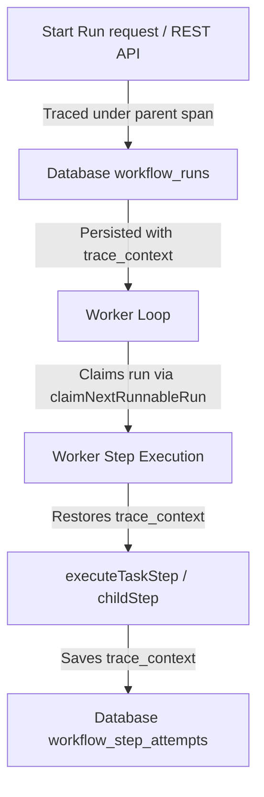

# Observability and OpenTelemetry Tracing

Hippo is instrumented with **OpenTelemetry (OTel)** tracing to provide end-to-end visibility into workflow definition executions, worker polls, run dispatch loops, and child run boundaries.

---

## Architecture Overview

Observability in Hippo uses W3C standard traceparent propagation, preserving tracing context across asynchronous boundaries (like queues, database state machines, and task worker dispatches).



---

## Trace Context Propagation

### 1. Database Schema
Every workflow execution and step execution stores trace information in the database:
- `workflow_runs.trace_context`: Holds the W3C traceparent string of the span that started the run.
- `workflow_step_attempts.trace_context`: Holds the W3C traceparent of the execution block that ran the task attempt.

### 2. Context Restoring / Propagation API
Hippo provides helpers in [tracing.ts](file:///home/blair/code/devmode/hippo/src/lib/tracing.ts) to manage trace context boundaries programmatically:
- `getActiveTraceContext()`: Extracts the current active W3C traceparent context.
- `withTraceContext(traceparent, callback)`: Executes the callback block inside the trace context specified by `traceparent`.

---

## Custom Instrumentation Guidelines

To add custom tracing inside workflows, steps, or custom worker loops, use the Hippo Tracer:

```typescript
import { createHippoTracer, getActiveTraceContext, withTraceContext } from "./lib/tracing.js"

const tracer = createHippoTracer({ scopeName: "my-custom-service" })

// Creating spans
await tracer.withSpan({ name: "my-span-name", attributes: { "custom.key": "value" } }, async (span) => {
  span.addEvent("something_happened", { details: "some details" })
  // Nested async operations will automatically carry the trace ID
})
```

### Propagating context manually
When dispatching message queues or executing async background jobs:
1. Capture the traceparent: `const traceparent = getActiveTraceContext()`
2. Send `traceparent` as metadata.
3. In the worker receiving the message, restore it:
   ```typescript
   await withTraceContext(traceparent, async () => {
     // Spans created here will link back to the original publisher trace
   })
   ```
